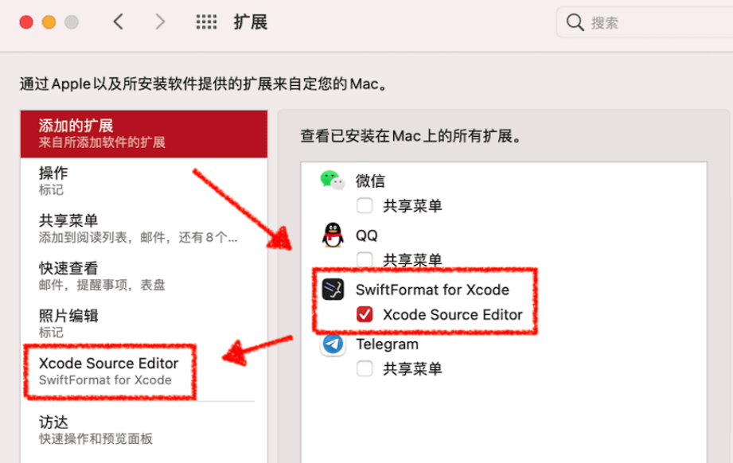

## Swift代码规范

[TOC]

Swift代码规范为[Apple官方Swift代码规范](https://docs.swift.org/swift-book/LanguageGuide/TheBasics.html)文档的补充文档，此文档将从以下几个方面进行叙述：

### 一、命名规范

- 命名应该具有描述性和清晰的意义，比如

```Swift
  // 推荐
  class RoundAnimatingButton: UIButton {}
  // 不推荐
  class CustomButton: UIButton {}
```


#### 1.文件夹及源码文件命名

- 使用**大驼峰命名法**命名，首字母大写，例如：AliasAnalysis.swift。关于大驼峰命名、小驼峰命名参考：[ 维基百科 驼峰式大小写](https://zh.wikipedia.org/wiki/駝峰式大小寫)

  

#### 2.类型

- 类型名称（如 struct, enum, class, typedef, associatedtype, protocol 等）使用**大驼峰命名法**命名，首字母大写，比如：`HomeViewController`

- Swift中类别(类，结构体)在编译时会把模块设置为默认的命名空间，所以不用为了区分类别而添加前缀，比如RW。
- 如果担心来自不同模块的两个名称发生冲突，可以在使用时添加模块名称来区分。注意不要滥用模块名称，仅在有可能发生冲突或疑惑的场景下使用。如：

```swift
import SomeModule 
let myClass = SomeModule.UsefulClass()
```

- 函数、方法、属性、常量、变量、参数名称、枚举选项 以**小驼峰命名法**命名（第一个单字以小写字母开始；第二个单字的首字母大写）例如：firstName、lastName。

```swift
enum OrderStatus {
    case normal
    case expired
    case paid
}

struct AliasAnalysis {
  let bridged: BridgedAliasAnalysis
  
  func mayRead(_ inst: Instruction, fromAddress: Value) -> Bool {
    ...
  }

  func mayWrite(_ inst: Instruction, toAddress: Value) -> Bool {
    ...
  }

  func mayReadOrWrite(_ inst: Instruction, address: Value) -> Bool {
    ...
  }
}
```

- 扩展方法名
  采用驼峰命名法，首字母小写，并用小写的项目缩写名+下划线作为前缀，比如：

  ```Swift
    extentsion UIView {
        func gy_removeAllSubViews() {
            ...
        }
    }
  ```


- 泛型：泛型类参数应具有描述性，遵守“大骆驼命名法”。如果一个参数名没有具体的含义，可以使用传统单大写字符，如T, U, 或V等。
  正确代码：

```swift
struct Stack<Element>{ ... }
func writeTo <Target: OutputStream>(to Target: inout Target)
func swap(_ a: inout T, _ b: inout T) 
```

​      错误代码：

```swift
struct Stack<T>{ ... }
func write<target: OutputStream> (to target: inout target)
func swap<Thing>(_ a: inout Thing, _ b: inout Thing)
```


#### 3.变量

- 全局常量名
  采用驼峰命名法，首字母大写，并用g名为前缀，比如：`let gAnimationDuration: TimeInterval = 1.0`

- UIKit控件命名：
  - 控制器类名：采用大驼峰命名法，以“ViewController”结尾，比如： `OrderViewController`
  - 视图类名：采用大驼峰命名法，以“View”，比如：`OrderDetailView`
  -  UI组件如Lable，Button等，需要在名称中指明类型，比如：`nameLabel`、`confirmButton`

- 代理变量名
  统一使用“delegate”，并用weak修饰，比如： `weak var delegate: OrderCellDelegate`

  

#### 4.资源文件命名

- 模块前缀：资源需要以主要模块名称开头，然后下划线+名称，比如：`live_xxx.png`。
- 功能后缀：资源可以通过下划线+功能结尾来明确资源用途，比如：按钮`_btn`，图标`_icon`，背景`_bg`，`live_xxx_icon.png`。
- 状态后缀：以按钮为例，`live_xxx_btn_normal`（普通状态），`live_xxx_btn_selected`（选中状态）。
- 特殊后缀：如果资源分成多块之类的情况，加一层特殊后缀，用下划线隔开，比如：`common_tip_letf.png`，`common_tip_right.png`。


### 二、代码结构

- 善用 MARK: - LifeCycle` 进行分段
- 推荐代码分段：分段的原则：系统方法、对外方法等操作频繁的放到容易开始，实例化变量、界面布局等放到最后

```swift
import UIKit
import Foundation

class <#Controller name#>: BaseViewController {
    // MARK: - Property
  
    // MARK: - Lifecycle
    @objc func injected() {
        #if DEBUG
            yxc_debugPrint("I've been injected: \(self)")
            setupUI()
            setupConstraints()
        #endif
    }
  
    override func viewDidLoad() {
        super.viewDidLoad()
        setupUI()
        setupConstraints()
    }
    
    override func viewWillAppear(_ animated: Bool) {
        super.viewWillAppear(animated)
    }
    
    override func viewWillDisappear(_ animated: Bool) {
        super.viewWillDisappear(animated)
    }
    
    // 执行析构过程
    deinit {
        
    }
    
    // MARK: - Public
  
    // MARK: - Protocol
  
    // MARK: - IBActions
    
    // MARK: - Private
    
    // MARK: - UI
    func setupUI() {
        title = ""
        
    }
    
    // MARK: - Constraints
    func setupConstraints() {
        
    }
    
    // MARK: - 懒加载
    
}

```


### 三、编码风格

- 尽可能选择`let`而非`var`

- 苹果代码注释风格：
  - 类或代码块使用：//===----------===// 风格
  - 类方法使用：/// xxx
  - 方法内使用：// xxx

```swift
//===----------------------------------------------------------------------===//
//                              Lists
//===----------------------------------------------------------------------===//
public protocol ListNode : AnyObject {
  ...
}

public struct List<NodeType: ListNode> : Sequence,  where NodeType.Element == NodeType {
  private var currentNode: NodeType?
  
  public init(startAt: NodeType?) { currentNode = startAt }

  public mutating func next() -> NodeType? {
    ...
  }
        
  /// Returns true if reference counting and debug_value users of a global_value
  /// can be deleted.
  public var customMirror: Mirror {
    // Projection instructions don't access the object header, so they don't
    // prevent deleting reference counting instructions.
    let c: [Mirror.Child] = map { (label: nil, value: $0) }
    return Mirror(self, children: c)
  }
}
```

...


### 四、代码格式

#### 1.[格式化插件SwiftFormat安装](https://github.com/nicklockwood/SwiftFormat)

##### Xcode 编辑器扩展安装

```shell
# 安装
$ brew install --cask swiftformat-for-xcode

# 已经安装的升级
$ brew upgrade --cask swiftformat-for-xcode
```

- 双击打开安装后的SwiftFormat for Xcode app

- 系统配置->扩展->选择：Xcode Source Editor，勾选 SwiftFormat for Xcode选项，如下图：

  


- 重新启动Xcode，启动后，在Xcode-> Edit-> SwiftFormat菜单


##### Xcode编译时格式化代码

- Poffile添加库，然后执行：```pod install```

  ```shell
  pod 'SwiftFormat/CLI'
  ```

- Xcode-> 选择TARGETS下的目标-> 选择：Build Phases tab标签 -> 点击添加 New Run Script Phase -> 将添加的运行脚本拖到 Compile Sources 上方 -> 添加下面命令行

  ```shell
  # 如果不指定目录会将Pod库的代码也会格式化
  "${PODS_ROOT}/SwiftFormat/CommandLineTool/swiftformat" "$SRCROOT/目录"
  ```


#### 2.代码格式

- 把左大括号放在新行，代码更加紧凑，代码格式工具会自动调整

```swift
class SomeClass {
    func someMethod() {
        if x == y {
        } else {
          
        }
    }
}
```

- 一个函数的长度不应该超过 60 行 
  当函数长度超过 80 行后，应该将内部一些复杂的逻辑提炼出来，形成新的函数，然后调用之。

- 每行代码长度建议不超过 120，不利于阅读 
  建议每一行代码的长度超过 120 字符时做折行处理，处理时请以结构清晰为原则。通过 “Xcode => Preferences => TextEditing => 勾选  Page guide at column: 120 => OK” 来设置提醒。

- 每个类原则上不超过 600 行 
  一个类不应该将很多复杂的逻辑揉合到一起来实现，我们约定当文件超过 600 行时，要考虑将这个文件进行拆分，可以使用协议方法来分离功能代码。如果逻辑过于复杂，则应该考虑从设计上将一些内部可以独立的逻辑提炼出来，形成新的类，以减轻单一类的复杂度。


### 五、参考资料：

- [Swift代碼格式化](https://codertw.com/程式語言/739243/#outline__2_1)

- [Swift代码规范](https://iamlay.com/2020/08/28/week2020-36/)

