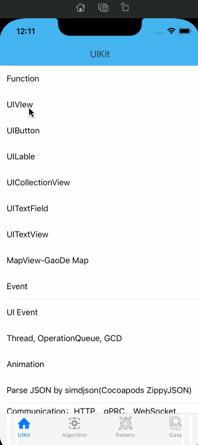

## SwiftCase

**SwiftCase** is a pure Swift development example that includes basic component usage, design patterns, algorithms, and some small examples.




### [中文文档](./README_ZH.md)


### [ 网站资料 - 力学笃行](https://fd-learning.com/learner/page/index.html)


### Features

---

- **UIKit**

  - Function - Describes the usage of strings, arrays, dictionaries, sets, and tuples
  - UIVIew 
  - UIButton
  - UILable
  - UICollectionView
  - UITextField
  - UITextView
  - MapView-GaoDe Map
  - Event
  - UI Event
  - Thread, OperationQueue, GCD
  - Animation
  - Parse JSON by simdjson(Cocoapods ZippyJSON)
  - Communication：HTTP、gPRC、WebSocket、Bluetooth、Wifi

  

- **Algorithms**

  - Swift-algorithms
  - Collections: Array、Dictionary、Sets
  - Array2D: two-dimensional array
  - Linked List
  - Stack
  - Queue
  - Recursion  
  - Bubble Sort   
  - Insertion Sort   
  - Selection Sort  
  - *Quick Sort   
  - Merge Sort  
  - Bucket Sort  
  - Counting Sort   
  - Radix Sort   
  - Binary Search   
  - Skip List  
  - Hash Table   
  - LRU(Least Recently Used) Cache   
  - Binary Tree   
  - Binary Search Tree (BST)   
  - AVL tree (named after inventors Adelson-Velsky and Landis)
  - Red-Black Tree   
  - Heap  
  - Heap Sort   
  - Graph  
  - Depth-First Search   
  - Breadth-First Search   
  - Brute Force string search   
  - Rabin-Karp string search   
  - Boyer-Moore string search   
  - Knuth-Morris-Pratt string search
  - Trie 
  - Aho-Corasick
  - Huffman Coding  
  - Dijkstra's shortest path 
  - Bit Set  
  - Bloom Filter   
  - B-Tree

  

- **Design Patterns**

  - Creational
    - Singleton          
    - Factory            
    - AbstractFactory                 
    - Builder                 
    - Prototype 
  - Structural          
    - Proxy           
    - Bridge           
    - Decorator           
    - Adapte           
    - Flyweight           
    - Composite
  - Behavioral       
    - Subscriber       
    - Accessor        
    - Strategy           
    - ChainResponsibility       
    - Iterator           
    - State           
    - Visitor           
    - Memento           
    - Mediator           
    - Interpreter

  

- **Case**

  - Brows Images
  - Call OC function
  - List


### Requirements
iOS 13.0+ 


### Installation
Download SwiftCase and you need to execute ```Pod Install``` to use it


### Author
ForrestWang mail: forrestwang@aliyun.com


### License
SwiftCase is released under the MIT license. See LICENSE for details.
