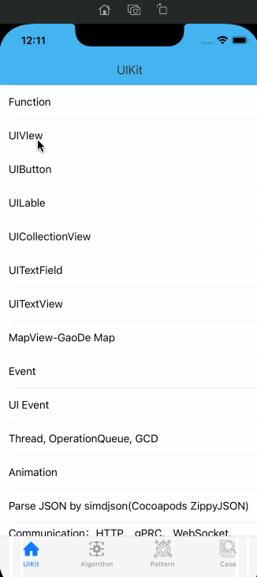

## SwiftCase

SwiftCase is a pure Swift development example that includes basic component usage, design patterns, algorithms, and some small examples.



### [中文文档](./README_ZH.md)


### Features
- UIKit

  - Function - Describes the usage of strings, arrays, dictionaries, sets, and tuples

    

- Algorithms

  - Collections

    

- Design Patterns

  - Singleton

    

- Case

  - Brows Images


### Requirements
iOS 13.0+ 


### Installation
Download SwiftCase and you need to execute ```Pod Install``` to use it


### Author
ForrestWang mail: forrestwang@aliyun.com


### License
SwiftCase is released under the MIT license. See LICENSE for details.
