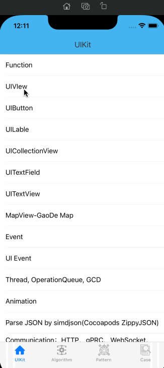

## SwiftCase

SwiftCase 是一个纯swift的开发示例，主要包括：基本组件用法、设计模式、算法及一些小的示例。



### [英文文档](./README.md)


### 特性

- UI组件

  - Function 介绍字符串、数组、字典、Set、元组的用法

    

- 算法

  - Collections 集合

    

- 设计模式

  - Singleton 单例

    

- 案例

  - Brows Images - 图片浏览


### 运行环境

iOS 13.0+ 


### 使用

将 SwiftCase 下载下来，需要执行 ```pod install```才能使用


### 联系

ForrestWang mail: forrestwang@aliyun.com


### 许可

SwiftCase是在MIT许可下发布的。详细信息请参见LICENSE。
